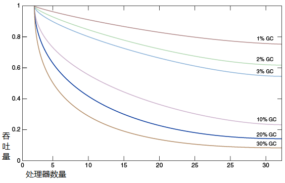

英文版来自于官方文档, 详情请参考下方的 [相关链接](#referlink)

# 1 简介

A wide variety of applications use Java Platform, Standard Edition (Java SE), from small applets on desktops to web services on large servers. In support of this diverse range of deployments, the Java HotSpot virtual machine implementation (Java HotSpot VM) provides multiple garbage collectors, each designed to satisfy different requirements. This is an important part of meeting the demands of both large and small applications. Java SE selects the most appropriate garbage collector based on the class of the computer on which the application is run. However, this selection may not be optimal for every application. Users, developers, and administrators with strict performance goals or other requirements may need to explicitly select the garbage collector and tune certain parameters to achieve the desired level of performance. This document provides information to help with these tasks. First, general features of a garbage collector and basic tuning options are described in the context of the serial, stop-the-world collector. Then specific features of the other collectors are presented along with factors to consider when selecting a collector.

A garbage collector (GC) is a memory management tool. It achieves automatic memory management through the following operations:

- Allocating objects to a young generation and promoting aged objects into an old generation.

- Finding live objects in the old generation through a concurrent (parallel) marking phase. The Java HotSpot VM triggers the marking phase when the total Java heap occupancy exceeds the default threshold. See the sections [Concurrent Mark Sweep (CMS) Collector](http://docs.oracle.com/javase/8/docs/technotes/guides/vm/gctuning/cms.html#concurrent_mark_sweep_cms_collector) and [Garbage-First Garbage Collector](http://docs.oracle.com/javase/8/docs/technotes/guides/vm/gctuning/g1_gc.html#garbage_first_garbage_collection).

- Recovering free memory by compacting live objects through parallel copying. See the sections The [Parallel Collector](http://docs.oracle.com/javase/8/docs/technotes/guides/vm/gctuning/parallel.html#CHDCFBIF) and [Garbage-First Garbage Collector](http://docs.oracle.com/javase/8/docs/technotes/guides/vm/gctuning/g1_gc.html#garbage_first_garbage_collection)

When does the choice of a garbage collector matter? For some applications, the answer is never. That is, the application can perform well in the presence of garbage collection with pauses of modest frequency and duration. However, this is not the case for a large class of applications, particularly those with large amounts of data (multiple gigabytes), many threads, and high transaction rates.

Amdahl's law (parallel speedup in a given problem is limited by the sequential portion of the problem) implies that most workloads cannot be perfectly parallelized; some portion is always sequential and does not benefit from parallelism. This is also true for the Java platform. In particular, virtual machines from Oracle for the Java platform prior to Java SE 1.4 do not support parallel garbage collection, so the effect of garbage collection on a multiprocessor system grows relative to an otherwise parallel application.

The graph in [Figure 1-1, "Comparing Percentage of Time Spent in Garbage Collection"](#Figure1-1) models an ideal system that is perfectly scalable with the exception of garbage collection (GC). The red line is an application spending only 1% of the time in garbage collection on a uniprocessor system. This translates to more than a 20% loss in throughput on systems with 32 processors. The magenta line shows that for an application at 10% of the time in garbage collection (not considered an outrageous amount of time in garbage collection in uniprocessor applications), more than 75% of throughput is lost when scaling up to 32 processors.

**Figure 1-1 Comparing Percentage of Time Spent in Garbage Collection**

[Description of "Figure 1-1 Comparing Percentage of Time Spent in Garbage Collection"](http://docs.oracle.com/javase/8/docs/technotes/guides/vm/gctuning/img_text/jsgct_dt_005_gph_pc_vs_tp.html)

This shows that negligible speed issues when developing on small systems may become principal bottlenecks when scaling up to large systems. However, small improvements in reducing such a bottleneck can produce large gains in performance. For a sufficiently large system, it becomes worthwhile to select the right garbage collector and to tune it if necessary.

The serial collector is usually adequate for most "small" applications (those requiring heaps of up to approximately 100 megabytes (MB (on modern processors). The other collectors have additional overhead or complexity, which is the price for specialized behavior. If the application does not need the specialized behavior of an alternate collector, use the serial collector. One situation where the serial collector is not expected to be the best choice is a large, heavily threaded application that runs on a machine with a large amount of memory and two or more processors. When applications are run on such server-class machines, the parallel collector is selected by default. See the section [Ergonomics](../02_Ergonomics/).

This document was developed using Java SE 8 on the Solaris operating system (SPARC Platform Edition) as the reference. However, the concepts and recommendations presented here apply to all supported platforms, including Linux, Microsoft Windows, the Solaris operating system (x64 Platform Edition), and OS X. In addition, the command line options mentioned are available on all supported platforms, although the default values of some options may be different on each platform.

### <a name="referlink">相关链接</a>

调优指南: [Java Platform, Standard Edition HotSpot Virtual Machine Garbage Collection Tuning Guide](http://docs.oracle.com/javase/8/docs/technotes/guides/vm/gctuning/)

翻译地址: [https://github.com/cncounter/GC-Tuning-Guide-CN](https://github.com/cncounter/GC-Tuning-Guide-CN)

翻译小组: [https://github.com/cncounter](https://github.com/cncounter)

翻译日期: [ 2015-09-01 ] ~ [ 预计  2016-01-01 ]

